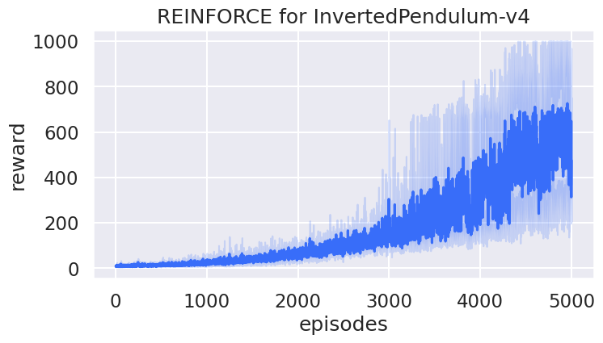
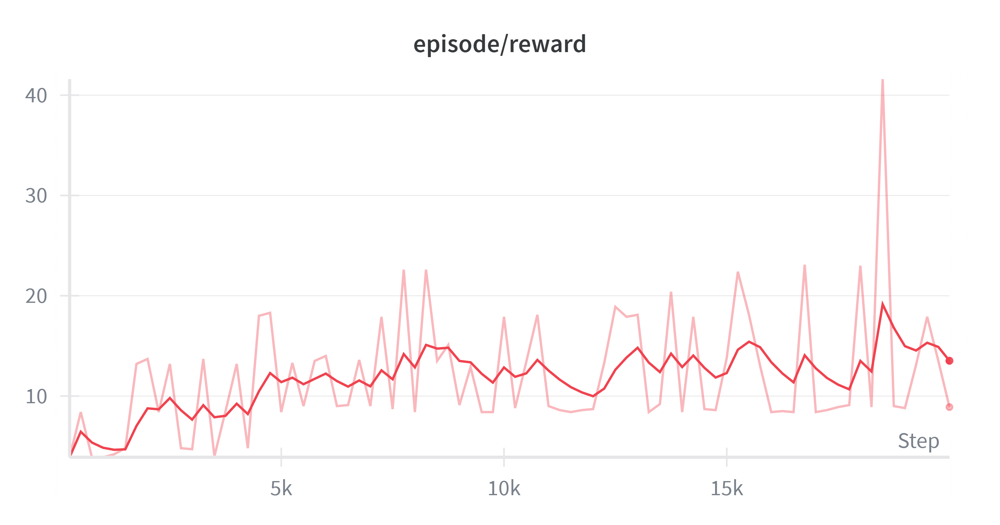
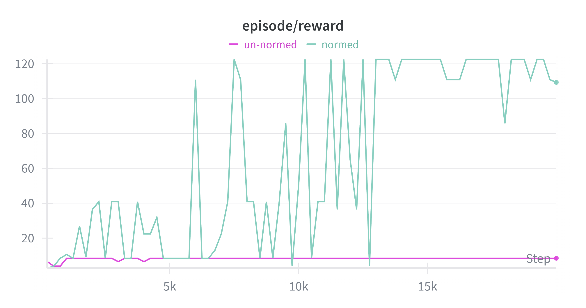
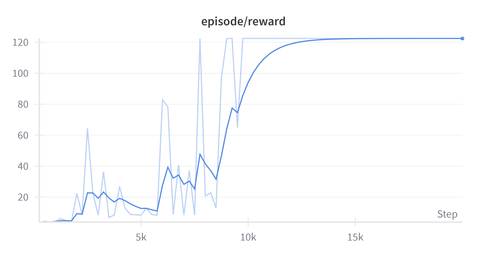

Reinforcement Learning Experiments
====================================

This repository contains my experiments with reinforcement learning algorithms. The main focus is on training agents to play Flappy Bird using outdated policy gradient algorithms and PPO.

<div align="center">
  
  <br>
  <em>Learned VPG policy playing FlappyBird-v0 after ~6 hours of training. (<a href="https://wandb.ai/jacobnzw-n-a/reinforcement-learning-flappybird/sweeps/l3ziupxb/runs/qa2j0mg6/overview?nw=nwuserjacobnzw">W&B run</a>) </em>
</div>

## Codebase

```shell
uv sync

# Should install dependencies and print help message 
uv run flappybird/train_eval.py --help
```

The codebase is organized as follows:

- `flappybird/`
  - `train_eval.py`: training and w/ "online" evaluation
  - `train.py`: training script
  - `eval.py`: evaluation script
  - `agents.py`: RL agents and policy networks
  - `configs.py`: configuration dataclasses
  - `utils.py`: utility functions
  - `train_ppo.py`: PPO training script based on `stablebaselines3`

## Algorithms
Implementations of REINFORCE and VPG are just for learning purposes and practicing PyTorch. 
REINFORCE is so old that libs like StableBaselines don't even have it. 
I wanted to try to implement the algorithms from scratch to better understand them and do it without other complicating factors.

[OpenAI's SpinningUp](https://github.com/openai/spinningup/tree/master) has REINFORCE in the form of vanilla policy gradient (VPG) with all the bells and whistles (like GAE), although there it is fitted into the actor-critic "implementation pattern". 
On top of that, SpinningUp doesn't support `gymnasium` environments, which I needed for the `FlappyBird-v0`.

- *REINFORCE*
  - Episode-batched normalized returns (i.e. mean as baseline)
  - Optional entropy loss term to encourage exploration
- *Vanilla Policy Gradient with Value Function Baseline (VPG)*
  - Learned value function as baseline for returns
- *Proximal Policy Optimization (PPO)*
  - From `stablebaselines3`

In all cases, a simple feedforward network with 2 hidden layers of 128 units each is used for 
 - the policy netwok
 - the value network (for VPG and PPO)


## Environment
The environment used for training is [Flappy Bird Gymnasium](https://github.com/markub3327/flappy-bird-gymnasium/tree/main). It's a simple yet effective environment for testing RL algorithms.

I used **12-dimensional environment states** (via `use_lidar=False`) consisting of bird's position, velocity, and rotation, as well as the positions of the 3 pipes in front of the bird.

The **action** space is discrete, with 2 actions:
 - `0`: flap
 - `1`: do nothing

The **reward** structure is sparse:
 - `+1.0` for passing a pipe
 - `+0.1` for each frame alive (to encourage longer lives)
 - `-1.0` for death
 - `-0.5` for reaching top of screen (to penalize flying too high)


## Experiments
I ran a [W&B sweep for VPG](https://wandb.ai/jacobnzw-n-a/reinforcement-learning-flappybird/sweeps/l3ziupxb?nw=nwuserjacobnzw) to explore the effect of reward/observation normalization and fixed vs variable seeds on the final achieved reward.

```shell
wandb sweep sweep_config.yaml
wandb agent <sweep_id>
```

### VPG: Sparse vs Dense Rewards
I use `FlappyBird-v0` as an example of a sparse reward environment and 
`InvertedPendulum-v4` as an example of a dense reward environment.

REINFORCE works on `InvertedPendulum-v4` because it has dense rewards. The reward growth trend is apparent, albeit very noisy.



The final learned policy is able to balance the pendulum for a long time:

<div align="center">
  
  <br>
  <em>REINFORCE policy for InvertedPendulum-v4 after ~5k episodes.</em>
</div>

The `FlappyBird-v0` environment, on the other hand, has sparse rewards where the only substantial reward is given for passing a pipe. The basic policy gradient algorithms like REINFORCE and VPG are not well-suited for sparse reward environments.
 
I tried training a policy on `FlappyBird-v0` with REINFORCE as well as VPG. 
In practical terms, there is hardly any difference between the two. 
Adding a value function baseline in the VPG makes no fundamental difference in this case.

This can be seen in the perpetually rising and collapsing raw reward curve (faint red) over the course of 20_000 training episodes on `FlappyBird-v0`, which exhibits no growth trend (red). 
The reward peaks get higher over time but can't be sustained.



### VPG: Normalized Sparse Rewards
One way to deal with sparse rewards is to normalize them (together with observations), which I do via
`gym.wrappers.NormalizeReward` and `gym.wrappers.NormalizeObservation`.

Comparison of reward curves from normalized and un-normalized sparse rewards on `FlappyBird-v0` (seed fixed for both throughout the whole training).



Training with normalized rewards took around 6 hours:
reward 120 = 1000 episode steps * 0.1 + 20 pipes * 1.0



### Sample Efficiency: PPO vs VPG
A simple way to compare various RL training procedures is to simply ask how many environment interactions
does it take to learn a successful policy.
It's no secret that PPO needs way less environment interactions to learn successfull policy than VPG (or REINFORCE). 
In RL speak, it is said to be more sample efficient than VPG.

In my experiments, roughly speaking the respetable policy is learned by PPO after ~500k samples, while VPG needs ~10M samples - an order of magnitude difference!

I limited the `max_episode_steps=1000` to reasonably cap the training time of the VPG policy, since this algorithm has to wait until the episode finishes to update the policy parameters. 
1000 steps is roughly 20 pipe passes, which translates to reward around 120 (1000 * 0.1 for living + 20 * 1.0 for passing 20 pipes), which is thus the best we can hope for with VPG.

PPO is able to learn superior policy with fewer environment interactions and most importantly without having to wait for the episode to finish. This makes for a shorter training time and more efficient use of collected experience (samples).
The `stablebaselines3` implementation also uses vectorized environments to make training faster. For details see [`train_ppo.py`](flappybird/train_ppo.py).

<div align="center">
  
  <br>
  <em>Learned PPO policy playing FlappyBird-v0 reaches over 30 pipes at a fraction of the training time / samples.</em>
</div>


## Possible Improvements
RL is CPU-bound due to the environment interactions so the better we can utilize more cores the better. 
This can be helped by the use *vectorized environments* for training.

Another standard technique for controlling the bias-variance tradeoff is 
[Generalized Advantage Estimation (GAE)](https://shivang-ahd.medium.com/generalized-advantage-estimation-a-deep-dive-into-bias-variance-and-policy-gradients-a5e0b3454dad), 
which essentially provides better estimates of the advantage function in the policy gradient update.

## Misc
The RL theory takes some time setting up. [Gonkee's The FASTEST Introduction to Reinforcement Learning](https://youtu.be/VnpRp7ZglfA?si=02KyDUDj2Gi4Qeds) is a great introductory bird's eye view perspective on the whole field, which my [quick notes](RL_NOTES.md) are based on.
Otherwise, [Open AI Spinning Up](https://spinningup.openai.com/en/latest/) is incredibly good intro to RL, that's more formal and detailed.

### Links
 - [Gonkee's The FASTEST Introduction to Reinforcement Learning](https://youtu.be/VnpRp7ZglfA?si=02KyDUDj2Gi4Qeds)
 - [Deep Reinforcement Learning Doesn't Work Yet](https://www.alexirpan.com/2018/02/14/rl-hard.html)